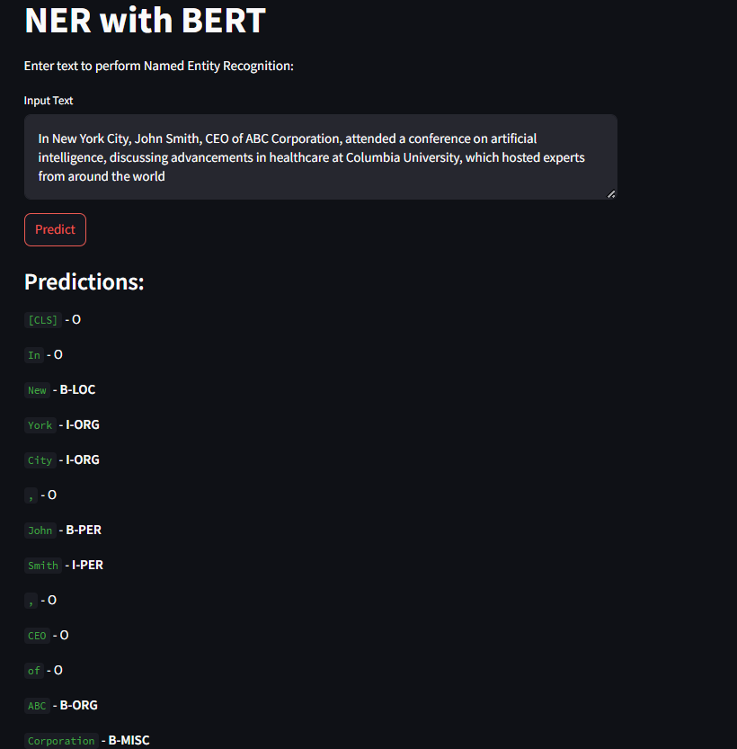

# NER with BERT

This project demonstrates how to use a fine-tuned BERT model for Named Entity Recognition (NER) using Streamlit for a simple web-based interface.

## Overview

This application allows users to input text and receive NER predictions from a BERT model. The BERT model is pre-trained and fine-tuned on the CoNLL-2003 dataset for NER tasks.

- It contains a `.ipynb` file which contains the full code of fine-tuning BERT (base_uncased, 110M parameters) on the CoNLL dataset and saving this model.
- It contains `app.py`, which is an app built on the trained model.

## Usage

- To use the app, type the following command:

  ```bash
  streamlit run app.py


- Here is an image of running app

